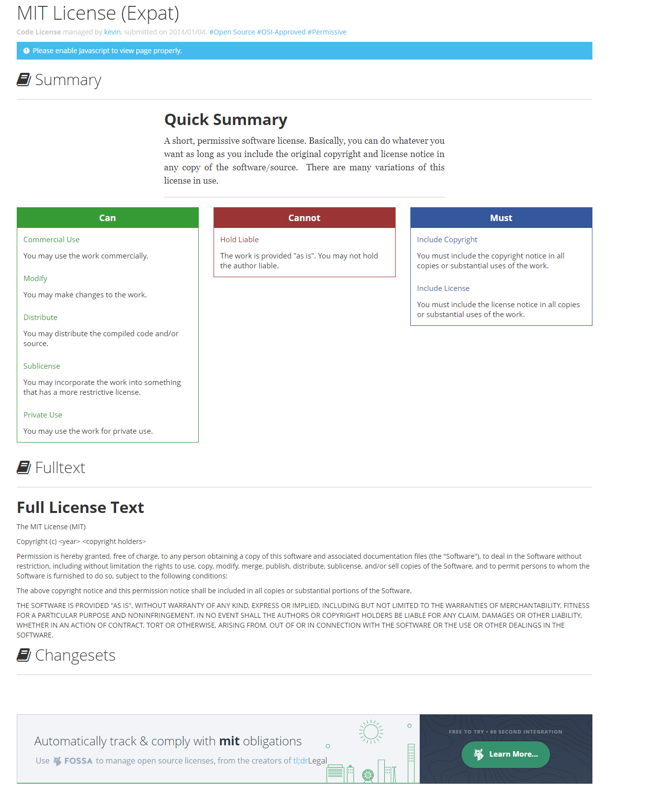

# 🚀 Add a License to Your package.json 🚀<!-- omit in TOC -->

<div align="center">


|[previous](./../3_Add-Keywords-to-Your-package-json/Readme.md)|[index](./../../Readme.md)|[next](./../5_Add-a-Version-to-Your-package-json/Readme.md)|
|---|---|---|

</div>

## Summary <!-- omit in TOC -->

- [Task](#task)
- [Concepts](#concepts)
  - [licence](#licence)
  - [package.json](#packagejson)
- [Ressource](#ressource)

<br>
<br>

____

## Task

You can add license information to your packages and projects to dictate how others can use your work. Some common licenses for open source projects include MIT and BSD. License information is not required, and copyright laws in most countries will give you ownership of what you create by default.

Create a new key called ``license`` in ``package.json`` and specify any kind of license name as a string value, I went with ``MIT``.

```json
"license": "MIT",
```

<br>

## Concepts

### licence

You should specify a license for your package so that people know how they are permitted to use it, and any restrictions you’re placing on it.

```json
"license": "MIT",
```

In order to know which licence to use you can use this website wich explain shortly the meaning of the licence : 
<details>
<summary>tm;drLegal</summary>

* [tm;drLegal](https://tldrlegal.com/license/mit-license)




</details>

<details>
<summary>choose a licenses</summary>

* [choose a licenses](https://choosealicense.com/)


</details>

### package.json

All npm packages contain a file, usually in the project root, called package.json - this file holds various metadata relevant to the project. This file is used to give information to npm that allows it to identify the project as well as handle the project's dependencies. It can also contain other metadata such as a project description, the version of the project in a particular distribution, license information, even configuration data - all of which can be vital to both npm and to the end users of the package. The package.json file is normally located at the root directory of a Node.js project.


<br>
<br>

<div align="center">


|[previous](./../3_Add-Keywords-to-Your-package-json/Readme.md)|[index](./../../Readme.md)|[next](./../5_Add-a-Version-to-Your-package-json/Readme.md)|
|---|---|---|

</div>


<br>
<br>

## Ressource

* [Add a Licenses to Your package.json [ganesh][article]](https://www.notion.so/Add-a-License-to-Your-package-json-f6f064924cc048b7a638bc13cbfbce52)
* [What is the file `package.json`? [official][article]](https://nodejs.org/en/knowledge/getting-started/npm/what-is-the-file-package-json/#:~:text=All%20npm%20packages%20contain%20a,as%20handle%20the%20project's%20dependencies.&text=The%20package.,-json%20file%20is)
* [configuring npm : ``package.json`` [npm][Docs]](https://docs.npmjs.com/cli/v8/configuring-npm/package-json)
* [tm;drLegal](https://tldrlegal.com/license/mit-license)
* [choose a licenses](https://choosealicense.com/)