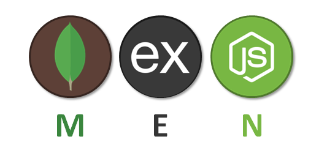
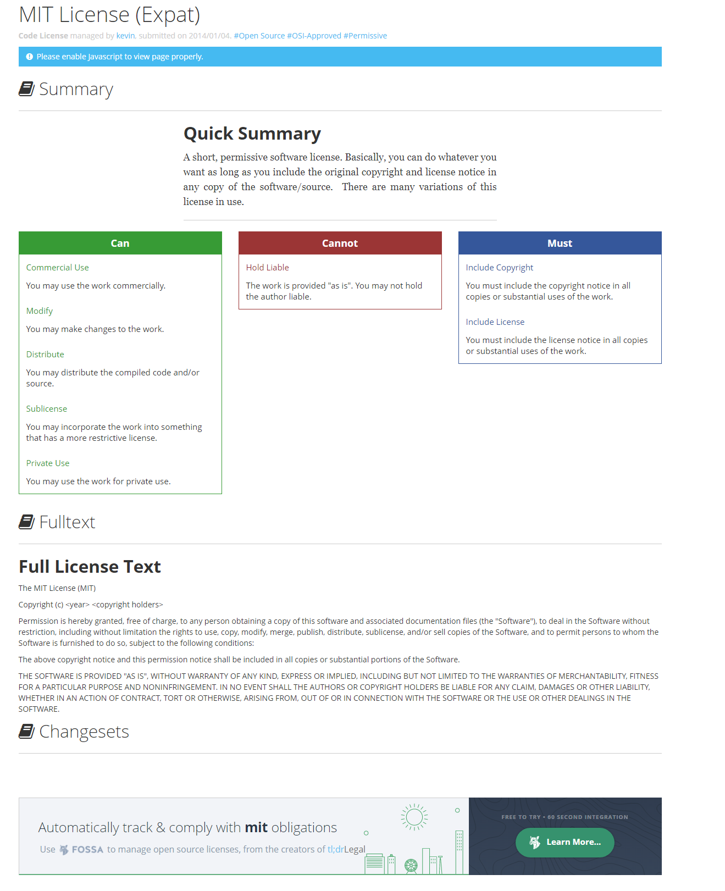
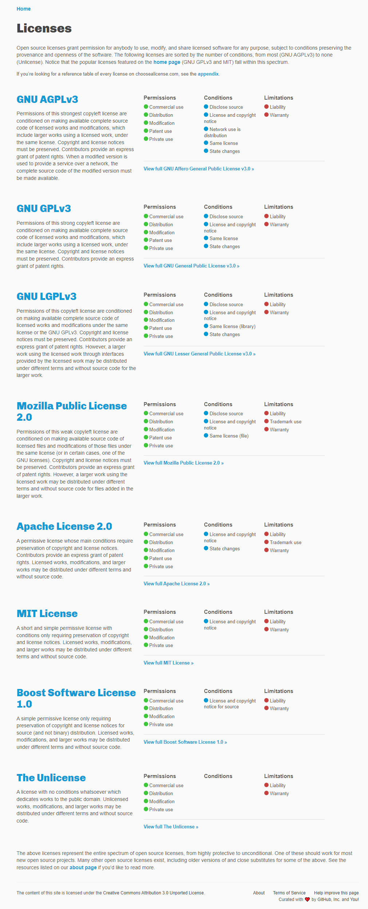
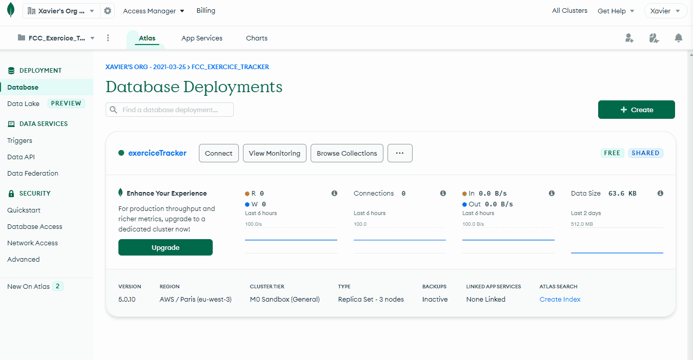
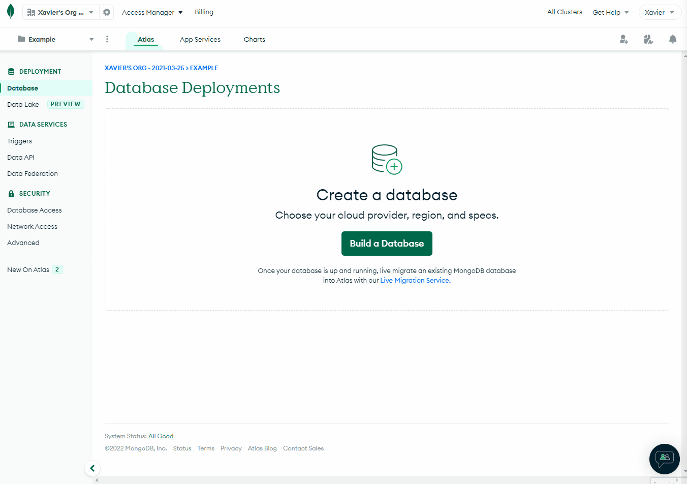
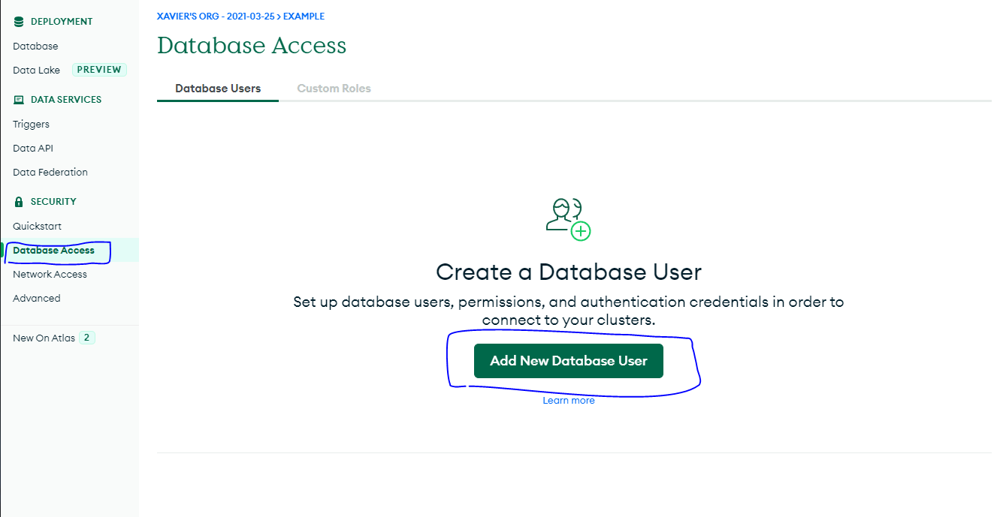
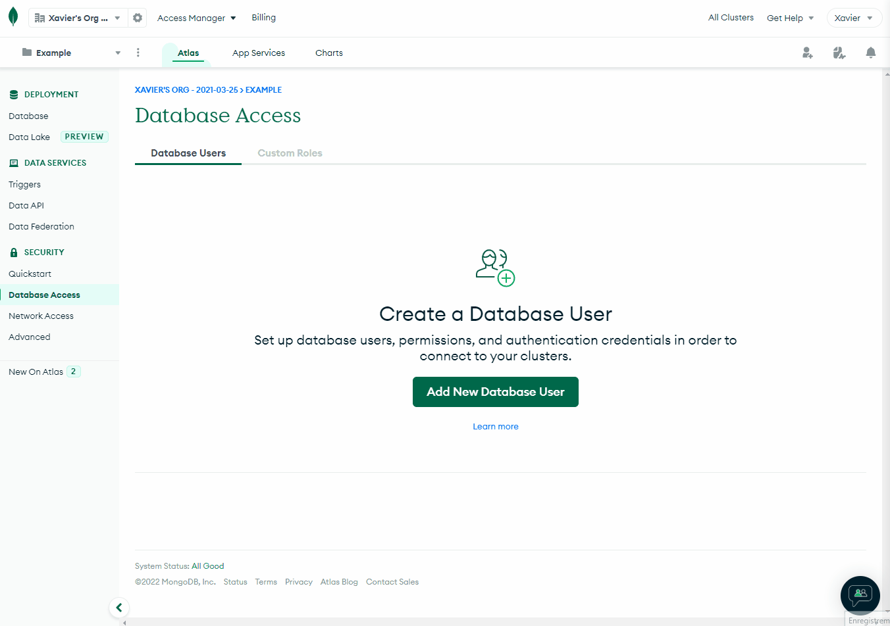
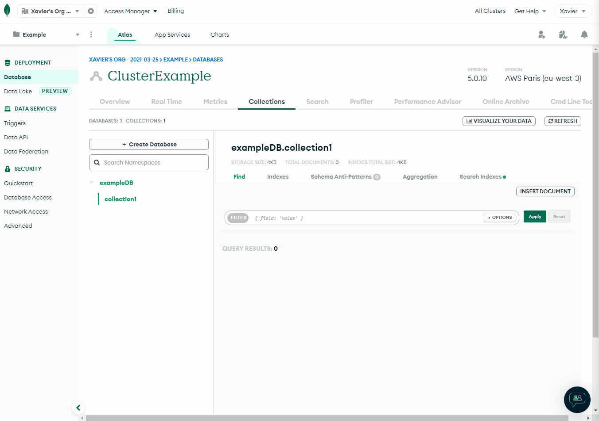
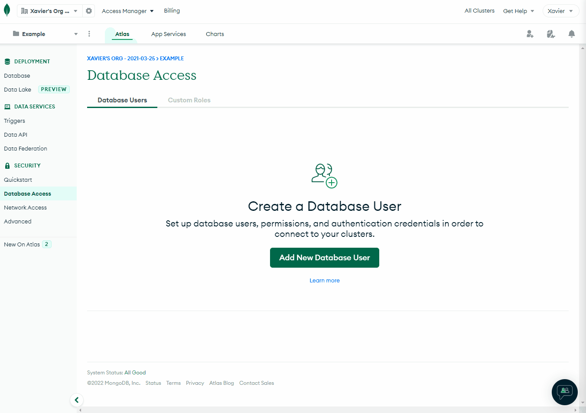
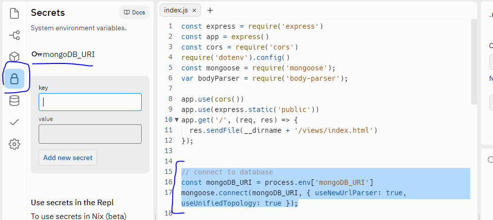

# 🚀 Freecodecamp certification : Back End Development and APIs 🚀
online course : https://www.freecodecamp.org/learn/back-end-development-and-apis/

## Stacks :
<div align="center">



</div>

* NPM (Node Package Manager)
* Node
* Express
* MongoDB
* Mongoose
* SemVer (Semantic Versioning) - industry standard for software versioning


## __Summary :__

<details>
<summary><CODE>Managing Packages with NPM</CODE></summary>

* [How to Use package json the Core of Any Node js Project or npm Package](./1_Managing-Packages-with-NPM/1_How-to-Use-package-json-the-Core-of-Any-Node-js-Project-or-npm-Package) > [code](./1_Managing-Packages-with-NPM/1_How-to-Use-package-json-the-Core-of-Any-Node-js-Project-or-npm-Package/package.json)  |  [readme](./1_Managing-Packages-with-NPM/1_How-to-Use-package-json-the-Core-of-Any-Node-js-Project-or-npm-Package/Readme.md)  |  [user story](./1_Managing-Packages-with-NPM/1_How-to-Use-package-json-the-Core-of-Any-Node-js-Project-or-npm-Package/UserStory.md)
* [Add a Description to Your package json](./1_Managing-Packages-with-NPM/2_Add-a-Description-to-Your-package-json) > [code](./1_Managing-Packages-with-NPM/2_Add-a-Description-to-Your-package-json/package.json)  |  [readme](./1_Managing-Packages-with-NPM/2_Add-a-Description-to-Your-package-json/Readme.md)  |  [user story](./1_Managing-Packages-with-NPM/2_Add-a-Description-to-Your-package-json/UserStory.md)
* [Add Keywords to Your package json](./1_Managing-Packages-with-NPM/3_Add-Keywords-to-Your-package-json) > [code](./1_Managing-Packages-with-NPM/3_Add-Keywords-to-Your-package-json/package.json)  |  [readme](./1_Managing-Packages-with-NPM/3_Add-Keywords-to-Your-package-json/Readme.md)  |  [user story](./1_Managing-Packages-with-NPM/3_Add-Keywords-to-Your-package-json/UserStory.md)
* [Add a License to Your package json](./1_Managing-Packages-with-NPM/4_Add-a-License-to-Your-package-json) > [code](./1_Managing-Packages-with-NPM/4_Add-a-License-to-Your-package-json/package.json)  |  [readme](./1_Managing-Packages-with-NPM/4_Add-a-License-to-Your-package-json/Readme.md)  |  [user story](./1_Managing-Packages-with-NPM/4_Add-a-License-to-Your-package-json/UserStory.md)
* [Add a Version to Your package json](./1_Managing-Packages-with-NPM/5_Add-a-Version-to-Your-package-json) > [code](./1_Managing-Packages-with-NPM/5_Add-a-Version-to-Your-package-json/package.json)  |  [readme](./1_Managing-Packages-with-NPM/5_Add-a-Version-to-Your-package-json/Readme.md)  |  [user story](./1_Managing-Packages-with-NPM/5_Add-a-Version-to-Your-package-json/UserStory.md)
* [Expand Your Project with External Packages from npm](./1_Managing-Packages-with-NPM/6_Expand-Your-Project-with-External-Packages-from-npm) > [code](./1_Managing-Packages-with-NPM/6_Expand-Your-Project-with-External-Packages-from-npm/package.json)  |  [readme](./1_Managing-Packages-with-NPM/6_Expand-Your-Project-with-External-Packages-from-npm/Readme.md)  |  [user story](./1_Managing-Packages-with-NPM/6_Expand-Your-Project-with-External-Packages-from-npm/UserStory.md)
* [Manage npm Dependencies By Understanding Semantic Versioning](./1_Managing-Packages-with-NPM/7_Manage-npm-Dependencies-By-Understanding-Semantic-Versioning) > [code](./1_Managing-Packages-with-NPM/7_Manage-npm-Dependencies-By-Understanding-Semantic-Versioning/package.json)  |  [readme](./1_Managing-Packages-with-NPM/7_Manage-npm-Dependencies-By-Understanding-Semantic-Versioning/Readme.md)  |  [user story](./1_Managing-Packages-with-NPM/7_Manage-npm-Dependencies-By-Understanding-Semantic-Versioning/UserStory.md)
* [Use the Tilde Character to Always Use the Latest Patch Version of a Dependency](./1_Managing-Packages-with-NPM/8_Use-the-Tilde-Character-to-Always-Use-the-Latest-Patch-Version-of-a-Dependency) > [code](./1_Managing-Packages-with-NPM/8_Use-the-Tilde-Character-to-Always-Use-the-Latest-Patch-Version-of-a-Dependency/package.json)  |  [readme](./1_Managing-Packages-with-NPM/8_Use-the-Tilde-Character-to-Always-Use-the-Latest-Patch-Version-of-a-Dependency/Readme.md)  |  [user story](./1_Managing-Packages-with-NPM/8_Use-the-Tilde-Character-to-Always-Use-the-Latest-Patch-Version-of-a-Dependency/UserStory.md)
* [Use the Caret Character to Use the Latest Minor Version of a Dependency](./1_Managing-Packages-with-NPM/9_Use-the-Caret-Character-to-Use-the-Latest-Minor-Version-of-a-Dependency) > [code](./1_Managing-Packages-with-NPM/9_Use-the-Caret-Character-to-Use-the-Latest-Minor-Version-of-a-Dependency/package.json)  |  [readme](./1_Managing-Packages-with-NPM/9_Use-the-Caret-Character-to-Use-the-Latest-Minor-Version-of-a-Dependency/Readme.md)  |  [user story](./1_Managing-Packages-with-NPM/9_Use-the-Caret-Character-to-Use-the-Latest-Minor-Version-of-a-Dependency/UserStory.md)
* [Remove a Package from Your Dependencies](./1_Managing-Packages-with-NPM/10_Remove-a-Package-from-Your-Dependencies) > [code](./1_Managing-Packages-with-NPM/10_Remove-a-Package-from-Your-Dependencies/package.json)  |  [readme](./1_Managing-Packages-with-NPM/10_Remove-a-Package-from-Your-Dependencies/Readme.md)  |  [user story](./1_Managing-Packages-with-NPM/10_Remove-a-Package-from-Your-Dependencies/UserStory.md)

</details>

<details>
<summary><CODE>Basic Node and Express</CODE></summary>

* [Meet the Node console](./2_Basic-Node-and-Express/1_Meet-the-Node-console) > [code](./2_Basic-Node-and-Express/1_Meet-the-Node-console/myApp.js)  |  [readme](./2_Basic-Node-and-Express/1_Meet-the-Node-console/README.md)
* [Start a Working Express Server](./2_Basic-Node-and-Express/2_Start-a-Working-Express-Server) > [code](./2_Basic-Node-and-Express/2_Start-a-Working-Express-Server/myApp.js)  |  [readme](./2_Basic-Node-and-Express/2_Start-a-Working-Express-Server/README.md)
* [Serve an HTML File](./2_Basic-Node-and-Express/3_Serve-an-HTML-File) > [code](./2_Basic-Node-and-Express/3_Serve-an-HTML-File/myApp.js)  |  [readme](./2_Basic-Node-and-Express/3_Serve-an-HTML-File/README.md)
* [Serve Static Assets](./2_Basic-Node-and-Express/4_Serve-Static-Assets) > [code](./2_Basic-Node-and-Express/4_Serve-Static-Assets/myApp.js)  |  [readme](./2_Basic-Node-and-Express/4_Serve-Static-Assets/README.md)
* [Serve JSON on a Specific Route](./2_Basic-Node-and-Express/5_Serve-JSON-on-a-Specific-Route) > [code](./2_Basic-Node-and-Express/5_Serve-JSON-on-a-Specific-Route/myApp.js)  |  [readme](./2_Basic-Node-and-Express/5_Serve-JSON-on-a-Specific-Route/README.md)
* [Use the  env File](./2_Basic-Node-and-Express/6_Use-the--env-File) > [code](./2_Basic-Node-and-Express/6_Use-the--env-File/myApp.js)  |  [readme](./2_Basic-Node-and-Express/6_Use-the--env-File/README.md)
* [Implement a Root Level Request Logger Middleware](./2_Basic-Node-and-Express/7_Implement-a-Root-Level-Request-Logger-Middleware) > [code](./2_Basic-Node-and-Express/7_Implement-a-Root-Level-Request-Logger-Middleware/myApp.js)  |  [readme](./2_Basic-Node-and-Express/7_Implement-a-Root-Level-Request-Logger-Middleware/README.md)
* [Chain Middleware to Create a Time Server](./2_Basic-Node-and-Express/8_Chain-Middleware-to-Create-a-Time-Server) > [code](./2_Basic-Node-and-Express/8_Chain-Middleware-to-Create-a-Time-Server/myApp.js)  |  [readme](./2_Basic-Node-and-Express/8_Chain-Middleware-to-Create-a-Time-Server/README.md)
* [Get Route Parameter Input from the Client](./2_Basic-Node-and-Express/9_Get-Route-Parameter-Input-from-the-Client) > [code](./2_Basic-Node-and-Express/9_Get-Route-Parameter-Input-from-the-Client/myApp.js)  |  [readme](./2_Basic-Node-and-Express/9_Get-Route-Parameter-Input-from-the-Client/README.md)
* [Get Query Parameter Input from the Client](./2_Basic-Node-and-Express/10_Get-Query-Parameter-Input-from-the-Client) > [code](./2_Basic-Node-and-Express/10_Get-Query-Parameter-Input-from-the-Client/myApp.js)  |  [readme](./2_Basic-Node-and-Express/10_Get-Query-Parameter-Input-from-the-Client/README.md)
* [Use body parser to Parse POST Requests](./2_Basic-Node-and-Express/11_Use-body-parser-to-Parse-POST-Requests) > [code](./2_Basic-Node-and-Express/11_Use-body-parser-to-Parse-POST-Requests/myApp.js)  |  [readme](./2_Basic-Node-and-Express/11_Use-body-parser-to-Parse-POST-Requests/README.md)
* [Get Data from POST Requests](./2_Basic-Node-and-Express/12_Get-Data-from-POST-Requests) > [code](./2_Basic-Node-and-Express/12_Get-Data-from-POST-Requests/myApp.js)  |  [readme](./2_Basic-Node-and-Express/12_Get-Data-from-POST-Requests/README.md)

</details>

<details>
<summary><CODE>MongoDB and Mongoose</CODE></summary>

* [Install and Set Up Mongoose](./3_MongoDB-and-Mongoose/1_Install-and-Set-Up-Mongoose) > [code](./3_MongoDB-and-Mongoose/1_Install-and-Set-Up-Mongoose/myApp.js)  |  [readme](./3_MongoDB-and-Mongoose/1_Install-and-Set-Up-Mongoose/README.md)
* [Create a Model](./3_MongoDB-and-Mongoose/2_Create-a-Model) > [code](./3_MongoDB-and-Mongoose/2_Create-a-Model/myApp.js)  |  [readme](./3_MongoDB-and-Mongoose/2_Create-a-Model/README.md)
* [Create and Save a Record of a Model](./3_MongoDB-and-Mongoose/3_Create-and-Save-a-Record-of-a-Model) > [code](./3_MongoDB-and-Mongoose/3_Create-and-Save-a-Record-of-a-Model/myApp.js)  |  [readme](./3_MongoDB-and-Mongoose/3_Create-and-Save-a-Record-of-a-Model/README.md)
* [Create Many Records with model create](./3_MongoDB-and-Mongoose/4_Create-Many-Records-with-model-create) > [code](./3_MongoDB-and-Mongoose/4_Create-Many-Records-with-model-create/myApp.js)  |  [readme](./3_MongoDB-and-Mongoose/4_Create-Many-Records-with-model-create/README.md)
* [Use model find to Search Your Database](./3_MongoDB-and-Mongoose/5_Use-model-find-to-Search-Your-Database) > [code](./3_MongoDB-and-Mongoose/5_Use-model-find-to-Search-Your-Database/myApp.js)  |  [readme](./3_MongoDB-and-Mongoose/5_Use-model-find-to-Search-Your-Database/README.md)
* [Use model findOne to Return a Single Matching Document from Your Database](./3_MongoDB-and-Mongoose/6_Use-model-findOne-to-Return-a-Single-Matching-Document-from-Your-Database) > [code](./3_MongoDB-and-Mongoose/6_Use-model-findOne-to-Return-a-Single-Matching-Document-from-Your-Database/myApp.js)  |  [readme](./3_MongoDB-and-Mongoose/6_Use-model-findOne-to-Return-a-Single-Matching-Document-from-Your-Database/README.md)
* [Use model findById to Search Your Database By id](./3_MongoDB-and-Mongoose/7_Use-model-findById-to-Search-Your-Database-By-id) > [code](./3_MongoDB-and-Mongoose/7_Use-model-findById-to-Search-Your-Database-By-id/myApp.js)  |  [readme](./3_MongoDB-and-Mongoose/7_Use-model-findById-to-Search-Your-Database-By-id/README.md)
* [Perform Classic Updates by Running Find Edit then Save](./3_MongoDB-and-Mongoose/8_Perform-Classic-Updates-by-Running-Find-Edit-then-Save) > [code](./3_MongoDB-and-Mongoose/8_Perform-Classic-Updates-by-Running-Find-Edit-then-Save/myApp.js)  |  [readme](./3_MongoDB-and-Mongoose/8_Perform-Classic-Updates-by-Running-Find-Edit-then-Save/README.md)
* [Perform New Updates on a Document Using model findOneAndUpdate](./3_MongoDB-and-Mongoose/9_Perform-New-Updates-on-a-Document-Using-model-findOneAndUpdate) > [code](./3_MongoDB-and-Mongoose/9_Perform-New-Updates-on-a-Document-Using-model-findOneAndUpdate/myApp.js)  |  [readme](./3_MongoDB-and-Mongoose/9_Perform-New-Updates-on-a-Document-Using-model-findOneAndUpdate/README.md)
* [Delete One Document Using model findByIdAndRemove](./3_MongoDB-and-Mongoose/10_Delete-One-Document-Using-model-findByIdAndRemove) > [code](./3_MongoDB-and-Mongoose/10_Delete-One-Document-Using-model-findByIdAndRemove/myApp.js)  |  [readme](./3_MongoDB-and-Mongoose/10_Delete-One-Document-Using-model-findByIdAndRemove/README.md)
* [Delete Many Documents with model remove](./3_MongoDB-and-Mongoose/11_Delete-Many-Documents-with-model-remove) > [code](./3_MongoDB-and-Mongoose/11_Delete-Many-Documents-with-model-remove/myApp.js)  |  [readme](./3_MongoDB-and-Mongoose/11_Delete-Many-Documents-with-model-remove/README.md)
* [Chain Search Query Helpers to Narrow Search Results](./3_MongoDB-and-Mongoose/12_Chain-Search-Query-Helpers-to-Narrow-Search-Results) > [code](./3_MongoDB-and-Mongoose/12_Chain-Search-Query-Helpers-to-Narrow-Search-Results/myApp.js)  |  [readme](./3_MongoDB-and-Mongoose/12_Chain-Search-Query-Helpers-to-Narrow-Search-Results/README.md)

</details>


<details>
<summary><CODE>Back End Development and APIs Projects</CODE></summary>

* [Timestamp Microservice](./4_Back-End-Development-and-APIs-Projects/1_Timestamp-Microservice) > [code](./4_Back-End-Development-and-APIs-Projects/1_Timestamp-Microservice/boilerplate-project-timestamp/)  |  [readme](./4_Back-End-Development-and-APIs-Projects/1_Timestamp-Microservice/README.md) | [Replit](https://replit.com/@XavierPierre/Project-timestamp)
* [Request Header Parser Microservice](./4_Back-End-Development-and-APIs-Projects/2_Request-Header-Parser-Microservice) > [code](./4_Back-End-Development-and-APIs-Projects/2_Request-Header-Parser-Microservice/boilerplate-project-headerparser/)  |  [readme](./4_Back-End-Development-and-APIs-Projects/2_Request-Header-Parser-Microservice/README.md) | [Replit](https://replit.com/@XavierPierre/Project-header-parser)
* [URL Shortener Microservice](./4_Back-End-Development-and-APIs-Projects/3_URL-Shortener-Microservice) > [code](./4_Back-End-Development-and-APIs-Projects/3_URL-Shortener-Microservice/boilerplate-project-urlshortener/)  |  [readme](./4_Back-End-Development-and-APIs-Projects/3_URL-Shortener-Microservice/README.md) | [Replit](https://replit.com/@XavierPierre/Project-URL-shortener)
* [Exercise Tracker](./4_Back-End-Development-and-APIs-Projects/4_Exercise-Tracker) > [code](./4_Back-End-Development-and-APIs-Projects/4_Exercise-Tracker/boilerplate-project-exercisetracker/)  |  [readme](./4_Back-End-Development-and-APIs-Projects/4_Exercise-Tracker/README.md) | [Replit](https://replit.com/@XavierPierre/Projects-exercice-tracker)
* [File Metadata Microservice](./4_Back-End-Development-and-APIs-Projects/5_File-Metadata-Microservice) > [code](./4_Back-End-Development-and-APIs-Projects/5_File-Metadata-Microservice/boilerplate-project-filemetadata/)  |  [readme](./4_Back-End-Development-and-APIs-Projects/5_File-Metadata-Microservice/README.md) | [Replit](https://replit.com/@XavierPierre/Projects-filemetadata)

</details>

**Note :** This summary was generated by code, also every file and folder inside this repositary was generated with a python program.

<br>

## Cheatsheet :

### NPM (Node Package Manager)

#### Introduction NPM Versioning

If you plan to publish your package, the most important things in your package.json are the name and version fields as they will be required. The name and version together form an identifier that is assumed to be completely unique. Changes to the package should come along with changes to the version. If you don’t plan to publish your package, the name and version fields are optional.

```json
"version": "1.2.0",
```

<br>

See [semver](https://github.com/npm/node-semver#versions) for more details about specifying version ranges.

version Must match version exactly
* ``>version`` Must be greater than version
* ``>=version`` etc
* ``<version``
* ``<=version``
* ``~version`` "Approximately equivalent to version" See [semver](https://github.com/npm/node-semver#versions)
* ``^version`` "Compatible with version" See [semver](https://github.com/npm/node-semver#versions)
* ``1.2.x`` ``1.2.0``, ``1.2.1``, etc., but not ``1.3.0``
* ``http://...`` See 'URLs as Dependencies' below
* ``*`` Matches any version
* ``""`` (just an empty string) Same as ``*``
* ``version1 - version2`` Same as ``>=version1 <=version2``.
* ``range1 || range2`` Passes if either range1 or range2 are satisfied.
* ``git...`` See 'Git URLs as Dependencies' below
* ``user/repo`` See 'GitHub URLs' below
* ``tag`` A specific version tagged and published as tag [``See npm dist-tag``](https://docs.npmjs.com/cli/v8/commands/npm-dist-tag)
* ``path/path/path`` See [Local Paths](https://docs.npmjs.com/cli/v8/configuring-npm/package-json#local-paths) below

For example, these are all valid :

```json
{
  "dependencies": {
    "foo": "1.0.0 - 2.9999.9999",
    "bar": ">=1.0.2 <2.1.2",
    "baz": ">1.0.2 <=2.3.4",
    "boo": "2.0.1",
    "qux": "<1.0.0 || >=2.3.1 <2.4.5 || >=2.5.2 <3.0.0",
    "asd": "http://asdf.com/asdf.tar.gz",
    "til": "~1.2",
    "elf": "~1.2.3",
    "two": "2.x",
    "thr": "3.3.x",
    "lat": "latest",
    "dyl": "file:../dyl"
  }
}

```

<br>


#### 📚 industry standard for software versioning : Semantic Versioning (SemVer)

``Versions`` of the npm packages in the dependencies section of your package.json file follow what’s called ``Semantic Versioning (SemVer)``, an industry standard for software versioning aiming to make it easier to manage dependencies. Libraries, frameworks or other tools published on npm should use SemVer in order to clearly communicate what kind of changes projects can expect if they update.

Knowing SemVer can be useful when you develop software that uses external dependencies (which you almost always do). One day, __your understanding of these numbers will save you from accidentally introducing breaking changes to your project without understanding__ why things that worked yesterday suddenly don’t work today. This is how Semantic Versioning works according to the official website:</p>
```json
"package": "MAJOR.MINOR.PATCH"
```

* The ``MAJOR`` version should increment when you make incompatible API changes. 
* The ``MINOR`` version should increment when you add functionality in a backwards-compatible manner. 
* The ``PATCH`` version should increment when you make backwards-compatible bug fixes. 

This means that PATCHes are bug fixes and MINORs add new features but neither of them break what worked before. Finally, MAJORs add changes that won’t work with earlier versions.

<br>

[Additional labels for pre-release and build metadata are available as extensions to the MAJOR.MINOR.PATCH format.](https://semver.org/)

```
<valid semver> ::= <version core>
                 | <version core> "-" <pre-release>
                 | <version core> "+" <build>
                 | <version core> "-" <pre-release> "+" <build>

<version core> ::= <major> "." <minor> "." <patch>

<major> ::= <numeric identifier>

<minor> ::= <numeric identifier>

<patch> ::= <numeric identifier>

<pre-release> ::= <dot-separated pre-release identifiers>

<dot-separated pre-release identifiers> ::= <pre-release identifier>
                                          | <pre-release identifier> "." <dot-separated pre-release identifiers>

<build> ::= <dot-separated build identifiers>
```

<details>
<summary>pre-release : <code>MAJOR.MINOR.PATCH-PRE-RELEASE</code> => <code>1.2.13-alpha</code> or <code>1.2.13-0.1</code></summary>

A pre-release version MAY be denoted by appending a hyphen and a series of dot separated identifiers immediately following the patch version. Identifiers MUST comprise only ASCII alphanumerics and hyphens [0-9A-Za-z-]. Identifiers MUST NOT be empty. Numeric identifiers MUST NOT include leading zeroes. Pre-release versions have a lower precedence than the associated normal version. A pre-release version indicates that the version is unstable and might not satisfy the intended compatibility requirements as denoted by its associated normal version. 

Examples: 
```
1.0.0-alpha
1.0.0-alpha.1
1.0.0-0.3.7
1.0.0-x.7.z.92
1.0.0-x-y-z.–.
```

</details>

<details>
<summary>Build metadata : <code>MAJOR.MINOR.PATCH-PRE-RELEASE+BUILD</code> => <code>1.2.13-alpha+001</code> or <code>1.2.13-0.1+21AF26D3</code></summary>

Build metadata MAY be denoted by appending a plus sign and a series of dot separated identifiers immediately following the patch or pre-release version. Identifiers MUST comprise only ASCII alphanumerics and hyphens [0-9A-Za-z-]. Identifiers MUST NOT be empty. Build metadata MUST be ignored when determining version precedence. Thus two versions that differ only in the build metadata, have the same precedence.

Examples: 
```
1.0.0-alpha+001
1.0.0+20130313144700
1.0.0-beta+exp.sha.5114f85
1.0.0+21AF26D3—-117B344092BD.
```

</details>


<table>
    <thead>
        <tr>
            <td>Task</td>
            <td>Concept</td>
            <td>Example</td>
        </tr>
    </thead>
    <tbody>
        <tr>
            <td>


#### people fields : author, contributors

We look at the package.json file in a bit more detail. We then add some author information with the 'author' field in that file.

In 'package.json', add a new entry with : 
```json
"author:" : "<YOUR NAME>"
```

</td>
            <td>

##### people fields : author, contributors

* ``author`` is one ``person``. 
* ``contributors`` is an array of ``person``. 
* ``person`` is an object with a ``name`` field and optionally ``url`` and ``email`` like this:

```json
"author": {
  "name" : "Barney Rubble",
  "email" : "b@rubble.com",
  "url" : "http://barnyrubble.tumblr.com/"
}
```

Or you can shorten that all into a single string, and npm will parse it for you :
```json
{
  "author": "Barney Rubble <b@rubble.com> (http://barnyrubble.tumblr.com/)"
}
```
email and url are optional. npm also sets a top-level ``maintainers`` field with your npm user info.

<br>

###### contributors default value

And for ```"contributors": [...]```

If there is an ``AUTHORS`` file in the root of your package, npm will treat each line as a ``Name`` ``<email>`` ``(url)`` format, where email and url are optional. Lines which start with a ``#`` or are blank, will be ignored.

[``AUTHORS`` file example](https://github.com/nodejs/node/blob/main/AUTHORS)

```
# Authors ordered by first contribution.

Ryan Dahl <ry@tinyclouds.org>
Urban Hafner <urban@bettong.net>
Joshaven Potter <yourtech@gmail.com>
Abe Fettig <abefettig@gmail.com>
Kevin van Zonneveld <kevin@vanzonneveld.net>
```

And the ``AUTHORS`` file will populate the ``contributors`` array


</td>
            <td>

* people fields : author, contributors

```json
{
  "name": "fcc-learn-npm-package-json",
  "dependencies": {
    "express": "^4.14.0"
  },
  "main": "server.js",
  "scripts": {
    "start": "node server.js"
  },
  "repository": {
    "type": "git",
    "url": "https://idontknow/todo.git"
  },
  "author": "Xavier"
}
```

<br>

* contributors default value

[``AUTHORS`` file example](https://github.com/nodejs/node/blob/main/AUTHORS)

```
# Authors ordered by first contribution.

Ryan Dahl <ry@tinyclouds.org>
Urban Hafner <urban@bettong.net>
Joshaven Potter <yourtech@gmail.com>
Abe Fettig <abefettig@gmail.com>
Kevin van Zonneveld <kevin@vanzonneveld.net>
```

</td>
        </tr>
        <tr>
            <td>

#### add a description

Add a <code>description</code> to the package.json file of your project to describe our project or npm packed with the ``description`` field in ``package.json``.

In ``package.json``, add a new entry with 
```json
"description" : "<YOUR DESCRIPTION >"
```

</section></div><hr/><div><section id="instructions">

<p><strong>Note:</strong> Remember to use double-quotes for field-names (") and commas (,) to separate fields.</p>
</section></div><hr/></div>


</td>
            <td>

Put a description in it. It's a string. This helps people discover your package, as it's listed in ``npm search``.

```json
"description" : "<YOUR DESCRIPTION >"
```

</td>
            <td>

```json
{
  "name": "fcc-learn-npm-package-json",
  "dependencies": {
    "express": "^4.14.0"
  },
  "main": "server.js",
  "scripts": {
    "start": "node server.js"
  },
  "repository": {
    "type": "git",
    "url": "https://idontknow/todo.git"
  },
  "author": "Xavier",
  "description": "This is an example project"
}
```

</td>
        </tr>
        <tr>
            <td>

#### add Keywords


The ``keywords`` field is where you can describe your project using related ``keywords``. This will help your packages and projects get displayed to users when they search. You can add an array of related key word strings.

Add a ``keywords`` string to your ``package.json`` and make it an array of strings consisting of related keywords. Make sure you put ``freecodecamp`` as one of them.

In ``package.json``, add a new entry with 
```json
  "keywords": [
    "freecodecamp",
    "example",
    "project"
  ]
```

</td>
            <td>


The ``keywords`` field is where you can describe your project using related ``keywords``. This will help your packages and projects get displayed to users when they search. You can add an array of related key word strings.

Add a ``keywords`` string to your ``package.json`` and make it an array of strings consisting of related keywords. Make sure you put ``freecodecamp`` as one of them.

In ``package.json``, add a new entry with 
```json
  "keywords": [
    "freecodecamp",
    "example",
    "project"
  ]
```


</td>
            <td>

```json
{
  "name": "fcc-learn-npm-package-json",
  "dependencies": {
    "express": "^4.14.0"
  },
  "main": "server.js",
  "scripts": {
    "start": "node server.js"
  },
  "repository": {
    "type": "git",
    "url": "https://idontknow/todo.git"
  },
  "author": "Xavier",
  "description": "This is an example project",
  "keywords": [
    "freecodecamp",
    "example",
    "project"
  ]
}

```

</td>
        </tr>
            <td>

#### add a Licence

add license information to your packages and projects to dictate how others can use your work. Some common licenses for open source projects include MIT and BSD. License information is not required, and copyright laws in most countries will give you ownership of what you create by default.

Create a new key called ``license`` in ``package.json`` and specify any kind of license name as a string value, I went with ``MIT``.

```json
"license": "MIT",
```

</td>
            <td>

##### licence

You should specify a license for your package so that people know how they are permitted to use it, and any restrictions you’re placing on it.

```json
"license": "MIT",
```

In order to know which licence to use you can use this website wich explain shortly the meaning of the licence : 
<details>
<summary>tm;drLegal</summary>

* [tm;drLegal](https://tldrlegal.com/license/mit-license)




</details>

<details>
<summary>choose a licenses</summary>

* [choose a licenses](https://choosealicense.com/)



</details>

##### Ressource

* [Add a Licenses to Your package.json [ganesh][article]](https://www.notion.so/Add-a-License-to-Your-package-json-f6f064924cc048b7a638bc13cbfbce52)
* [tm;drLegal](https://tldrlegal.com/license/mit-license)
* [choose a licenses](https://choosealicense.com/)


</td>
            <td>

```json
{
  "name": "fcc-learn-npm-package-json",
  "dependencies": {
    "express": "^4.14.0"
  },
  "main": "server.js",
  "scripts": {
    "start": "node server.js"
  },
  "repository": {
    "type": "git",
    "url": "https://idontknow/todo.git"
  },
  "author": "Xavier",
  "description": "This is an example project",
  "keywords": [
    "freecodecamp",
    "example",
    "project"
  ],
  "license": "MIT"
}
```

</td>
        <tr>
        <tr>
            <td>

#### add version

A ``version`` is one of the required fields of your ``package.json`` file (if you want to publish your package otherwise this is optional). This field describes the current version of your project. Here's an example :
```json
"version": "1.2.0",
```

You must add a ``version`` key to every npm package, specifying the version number as a string.

Create or edit a ``version`` key the package.json, and add in a version number as a string. The number doesn't matter.
            
</td>
            <td>

___

**Note :** npm requires that all packages published confrom to Semantic Versioning, an industry standard. They take the form major.minor.patch, where major signifies non-backwards compatible API changes, minor feature updates and patch small bugfixes.

Edit the ``@freecodecamp/example`` package version key to be ``1.2.13`` → 1 major, 2 minor, 13 patch

```json
  "dependencies": {
    "express": "^4.14.0",
    "@freecodecamp/example": "1.2.13"
  },
```

See more information inside the introduction : 
* [Introduction NPM Versioning](#introduction-npm-versioning)
* [Semver industry standard for software versioning](#-industry-standard-for-software-versioning--semantic-versioning-semver)

___


            
</td>
            <td>

```json
{
  "name": "fcc-learn-npm-package-json",
  "version": "1.0.0",
  "dependencies": {
    "express": "^4.14.0"
  },
  "main": "server.js",
  "scripts": {
    "start": "node server.js"
  },
  "repository": {
    "type": "git",
    "url": "https://idontknow/todo.git"
  },
  "author": "Xavier",
  "description": "This is an example project",
  "keywords": [
    "freecodecamp",
    "example",
    "project"
  ],
  "license": "MIT"
}
```


            
</td>
        </tr>
        <tr>
            <td>

#### Expand Your Project with External Packages from npm

Dependencies are specified in a simple object that maps a package name to a version range. The version range is a string which has one or more space-separated descriptors. Dependencies can also be identified with a tarball or git URL.

```json
  "dependencies": {
    "express": "^4.14.0",
    "@freecodecamp/example": "1.2.13"
  },
```

___

**Note :** npm requires that all packages published confrom to Semantic Versioning, an industry standard. They take the form major.minor.patch, where major signifies non-backwards compatible API changes, minor feature updates and patch small bugfixes.

Edit the ``@freecodecamp/example`` package version key to be ``1.2.13`` → 1 major, 2 minor, 13 patch

```json
  "dependencies": {
    "express": "^4.14.0",
    "@freecodecamp/example": "1.2.13"
  },
```

___


</td>
            <td>

Dependencies are specified in a simple object that maps a package name to a version range. The version range is a string which has one or more space-separated descriptors. Dependencies can also be identified with a tarball or git URL.

```json
  "dependencies": {
    "express": "^4.14.0",
    "@freecodecamp/example": "1.2.13"
  },
```


</td>
            <td>

```json
{
  "name": "fcc-learn-npm-package-json",
  "version": "1.1.0",
  "dependencies": {
    "express": "^4.14.0",
    "@freecodecamp/example": "1.0.0"
  },
  "main": "server.js",
  "scripts": {
    "start": "node server.js"
  },
  "repository": {
    "type": "git",
    "url": "https://idontknow/todo.git"
  },
  "author": "Xavier",
  "description": "This is an example project",
  "keywords": [
    "freecodecamp",
    "example",
    "project"
  ],
  "license": "MIT"
}
```

</td>
        </tr>
        <tr>
            <td>

##### Use the Tilde-Character to Always Use the Latest Patch Version of a Dependency

In most use cases, you don’t want to miss bug fixes since they often include important security patches. To allow an npm dependency to update to the latest PATCH version, you can prefix the dependency’s version with the tilde (~) character.

Edit the ``@freecodecamp/example`` package version key to be ``~1.2.13`` → this ensures that it will get the latest patch version (``1.2.x`` where ``x`` is the latest patch)

```json
  "dependencies": {
    "express": "^4.14.0",
    "@freecodecamp/example": "~1.2.13"
  },
```

##### Use the Caret-Character to Use the Latest Minor Version of a Dependency

In most use cases, you don’t want to miss bug fixes since they often include important security patches. To allow an npm dependency to update to the latest PATCH version, you can prefix the dependency’s version with the tilde (~) character.

Edit the ``@freecodecamp/example`` package version key to be ``^1.2.13`` → this ensures that it will get the latest patch version (``1.x.y`` where ``x`` is the latest ``minor`` and ``y`` is the latest ``patch``)

```json
  "dependencies": {
    "express": "^4.14.0",
    "@freecodecamp/example": "^1.2.13"
  },
```

</td>
            <td>

##### Use the Tilde-Character to Always Use the Latest Patch Version of a Dependency

In most use cases, you don’t want to miss bug fixes since they often include important security patches. To allow an npm dependency to update to the latest PATCH version, you can prefix the dependency’s version with the tilde (~) character.

Edit the ``@freecodecamp/example`` package version key to be ``~1.2.13`` → this ensures that it will get the latest patch version (``1.2.x`` where ``x`` is the latest patch)

```json
  "dependencies": {
    "express": "^4.14.0",
    "@freecodecamp/example": "~1.2.13"
  },
```

##### Use the Caret-Character to Use the Latest Minor Version of a Dependency

In most use cases, you don’t want to miss bug fixes since they often include important security patches. To allow an npm dependency to update to the latest PATCH version, you can prefix the dependency’s version with the tilde (~) character.

Edit the ``@freecodecamp/example`` package version key to be ``^1.2.13`` → this ensures that it will get the latest patch version (``1.x.y`` where ``x`` is the latest ``minor`` and ``y`` is the latest ``patch``)

```json
  "dependencies": {
    "express": "^4.14.0",
    "@freecodecamp/example": "^1.2.13"
  },
```

</td>
            <td>

* Use the Tilde-Character to Always Use the Latest Patch Version of a Dependency

```json
{
  "name": "fcc-learn-npm-package-json",
  "version": "1.0.0",
  "dependencies": {
    "express": "^4.14.0",
    "@freecodecamp/example": "~1.2.13"
  },
  "main": "server.js",
  "scripts": {
    "start": "node server.js"
  },
  "repository": {
    "type": "git",
    "url": "https://idontknow/todo.git"
  },
  "author": "Xavier",
  "description": "This is an example project",
  "keywords": [
    "freecodecamp",
    "example",
    "project"
  ],
  "license": "MIT"
}
```

* Use the Caret-Character to Use the Latest Minor Version of a Dependency

```json
{
  "name": "fcc-learn-npm-package-json",
  "version": "1.0.0",
  "dependencies": {
    "express": "^4.14.0",
    "@freecodecamp/example": "~1.2.13"
  },
  "main": "server.js",
  "scripts": {
    "start": "node server.js"
  },
  "repository": {
    "type": "git",
    "url": "https://idontknow/todo.git"
  },
  "author": "Xavier",
  "description": "This is an example project",
  "keywords": [
    "freecodecamp",
    "example",
    "project"
  ],
  "license": "MIT"
}
```

</td>
        </tr>
    </tbody>

</table>

<br>

## Projets

Some of the project work with a mongoDB database. So to make them work a mongoDB database should be setup. For that this is an introduction guide in order to do that for free with atlas DB :
* [MongoDB Atlas Tutorial – How to Get Started [FreeCodeCamp][Article]](https://www.freecodecamp.org/news/get-started-with-mongodb-atlas/)
* [Introduction to the MongoDB and Mongoose Challenges [Ganesh][Article]](https://www.notion.so/Introduction-to-the-MongoDB-and-Mongoose-Challenges-12b4ad2e0ac744f686405021c5556dd0)

### MongoDB Atlas - How to get started ?

**MongoDB Setup:**

<details>
<summary>1. Go to MongoDB Atlas and Create an Account : https://www.mongodb.com/atlas/database</summary>

</details>

<details>
<summary>2. Create a new Project</summary>



</details>

<details>
<summary>2. Create a Free Shared Cluster, customizing the location and name if you wish</summary>



</details>

<details>
<summary>3. Go to Database Access, create a new user with a password (copy and paste this somewhere) and give the user read/write previlages</summary>



</details>

<details>
<summary>4. Go to Database > View Monitoring > Click Collection > Click Add my Own Data > and Create a Database and Collection (note down the database name)</summary>



</details>

<details>
<summary>5. Go to Network Access > Add IP Address > and add your IP address here or allow access from anywhere</summary>



</details>

<br>

#### Connect an app to your mongoDB database 

<details>
<summary>Go to database > Connect > Create a database user > Choose 'Connect with App' > Copy the URI and paste it somewhere because you will need it to connect our application : </summary>



</details>

**Note :** Note our user, password, and the uri :

URI example :
```
mongodb+srv://example:<password>@clusterexample.fww03mw.mongodb.net/?retryWrites=true&w=majority
```
compose like this :
```
mongodb+srv://<user>:<password>@clusterexample.fww03mw.mongodb.net/?retryWrites=true&w=majority
```
* `<user>` : Your User to connect to the database
* `<password>` : Your Password to connect to the database


<br>

Now to setup you just need to add this information as your environment variable. Here an example with Replit :

<table>
    <thead>
        <tr>
            <td>setup environnement variable</td>
            <td>connect to the database</td>
        </tr>
    </thead>
    <tbody>
        <tr>
            <td>



</td>
            <td>

```js
// connect to database
const mongoDB_URI = process.env['mongoDB_URI']
mongoose.connect(mongoDB_URI, 
{ useNewUrlParser: true, useUnifiedTopology: true });
```

</td>
        </tr>
    </tbody>
</table>

**Note:** The example project used in order to create the gif for the guide have been directly deleted after that. 

During the different project I use some basic concept such as create a REST API, crud, post request, get request, middleware, schema... this is already some concept that I already use inside some of my other projects for example [MERN Social Media Project](https://github.com/Xavier-Pierre-dev/MERN-Social-Media-project). 

<div align="center">


</div>

<details>
<summary>Screenshot : MERN Social Media Project</summary>

<br>

<div align="center">


</div>

</details>

Despite the example in this formation are quite simple they give a good entry point to start using : Node, Express, MongoDB and Mongoose. So this little project can be considered like note practice in order to create more complexe stuff. For example middleware are often use in order to create authentication / autorization method in order to protect our application. This is something I did inside the MERN project using JWT, and this is already a concept that I use in Java in order to do a SSO (single sign on) authentication with filter (basically middleware) in order to protect the access of our website/application. 

## __Storytelling__ : Why did i decid to get this certification ? 
I pass this certification for the same reason than i pass the HTML/CSS certification from FCC (freecodecamp) so the reason haven't change and can be found here => https://github.com/Xavier-Pierre-dev/FreeCodeCamp-Certification_Responsive-web-design.

<br>


## Ressource :

### NPM

* Semver (Semantic Versioning) - industry standard for software versioning
  * [SemVer](https://semver.org/lang/fr/)

* Licence : 
  * [licence : choose a licence ?](https://choosealicense.com/)
  * [licence : tldrlegal](https://tldrlegal.com/)

* Node Package Manager
  * [What is the file `package.json`? [official][article]](https://nodejs.org/en/knowledge/getting-started/npm/what-is-the-file-package-json/#:~:text=All%20npm%20packages%20contain%20a,as%20handle%20the%20project's%20dependencies.&text=The%20package.,-json%20file%20is)
  * [configuring npm : ``package.json`` [npm][Docs]](https://docs.npmjs.com/cli/v8/configuring-npm/package-json)
  * [Documentation link](https://docs.npmjs.com/cli/v8/configuring-npm/package-json)


